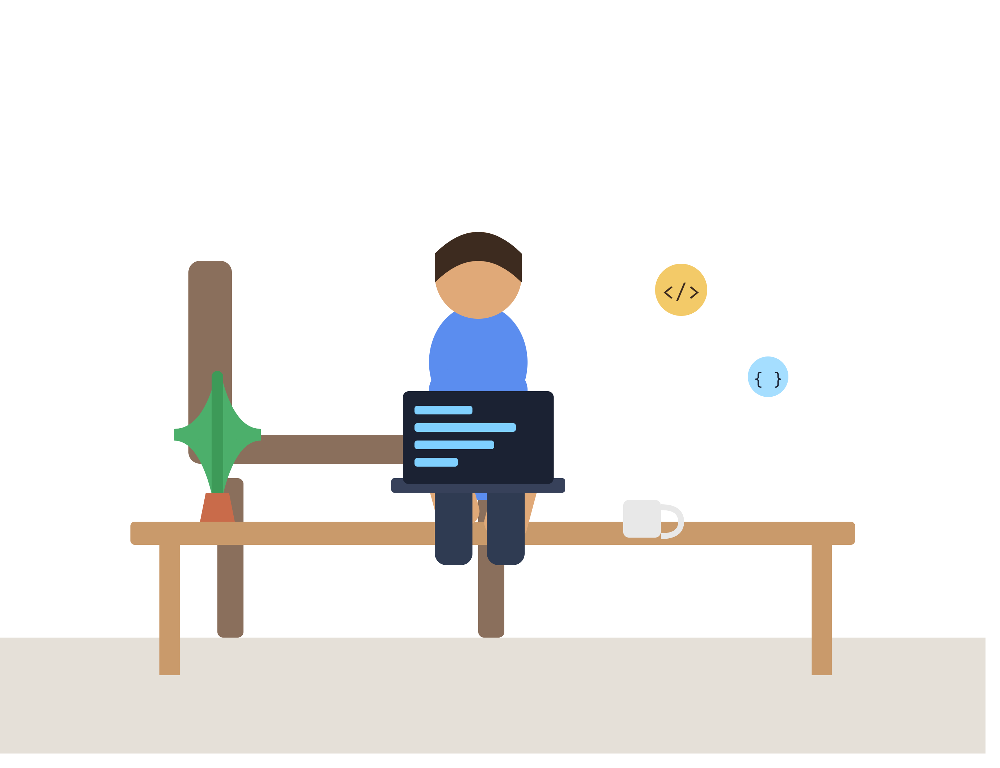

<h1 align="center">Hello 👋, I'm Hareesh </h1>
<h3 align="center">M.Tech EPD Student @IISc</h3>

  

<h3 align="left">Connect with me:</h3>

## 🌐 Socials:
 

### 🔧 Hardware & Programming Languages:

### EDA & Simulation Tools:

### Development Boards:

-%2300979D.svg?style=for-the-badge&logo=arm&logoColor=white)

<!--
**HAREESHSAMUDRALA/HAREESHSAMUDRALA** is a ✨ _special_ ✨ repository because its `README.md` (this file) appears on your GitHub profile.

Here are some ideas to get you started:

- 🔭 I’m currently working on ...
- 🌱 I’m currently learning ...
- 👯 I’m looking to collaborate on ...
- 🤔 I’m looking for help with ...
- 💬 Ask me about ...
- 📫 How to reach me: ...
- 😄 Pronouns: ...
- ⚡ Fun fact: ...
-->
